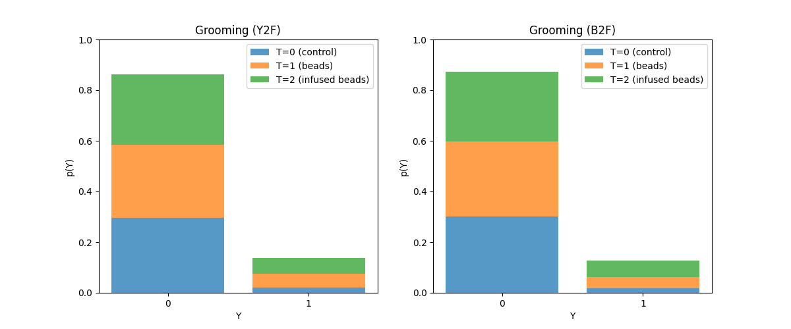

# ISTAnt

Automatic treatment effect estimation on ecological data with partial labelling

## Dataset description

### Data structure

### Example

  

    
<i>No Action</i>

    
  

  

    
<i>Grooming (Yellow)</i>

    
  

### Data Distribution

### Research Question

Identify and estimate:
$$ATE_{B} := \mathbb{E}[Y|do(T=1)]- \mathbb{E}[Y|do(T=0)]$$
$$ATE_{INF} := \mathbb{E}[Y|do(T=2)]- \mathbb{E}[Y|do(T=0)]$$
